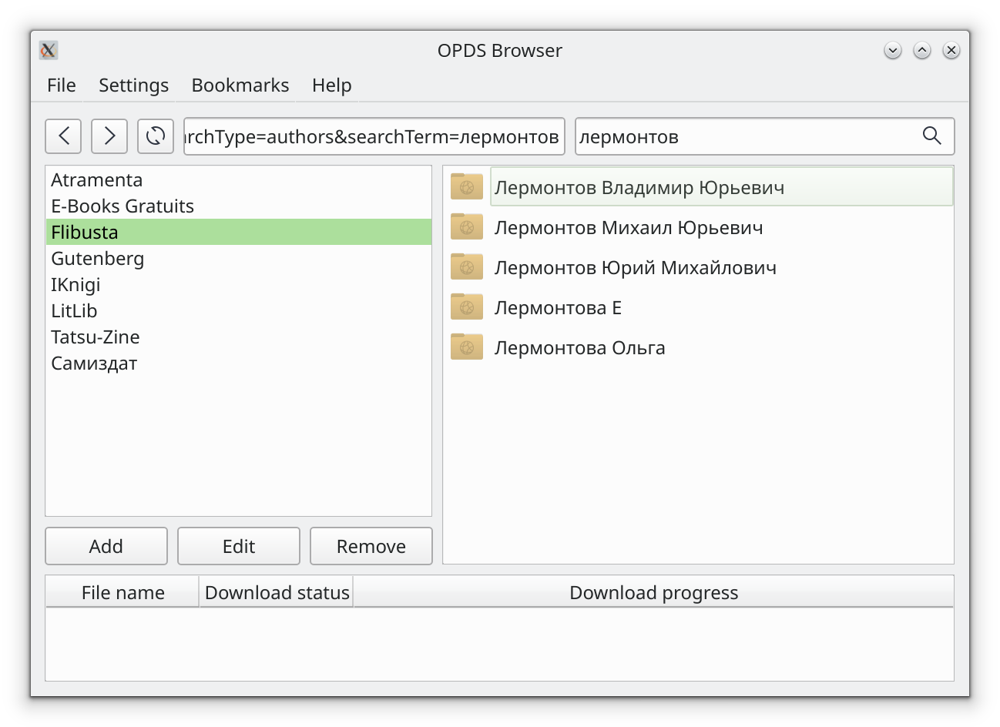

# qOPDSbrowser #



## About ##

Simple OPDS browser. Written with C++/Qt.

## Install on Debian 12 and Ubuntu 22.04 ##

Install dependencies:

```

apt install git cmake build-essential qt6-base-dev qt6-tools-dev
```

Clone repository:

```
git clone https://github.com/moose-kazan/qOPDSbrowser
```


Change directory:

```
cd qOPDSbrowser
```


Build it with CMake:

```
mkdir -p build && cd build && cmake .. && cmake
```

Run:

```
./qOPDSbrowser
```


## Contacts ##
Vadim V. Kalinnikov <moose@ylsoftware.com>


